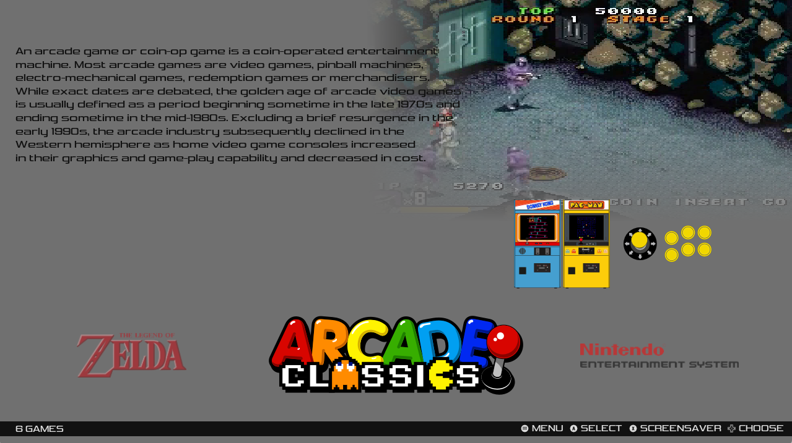
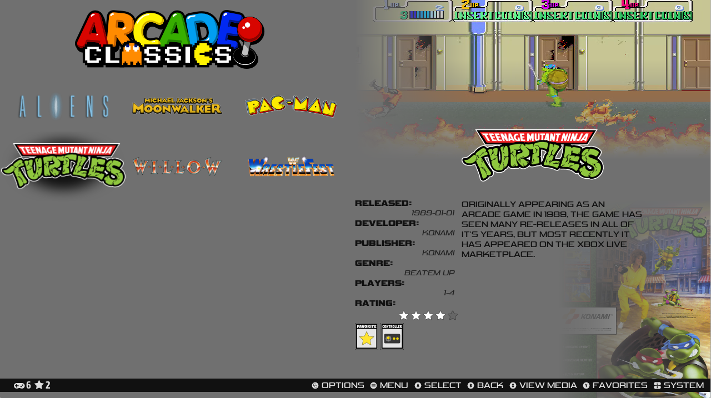

# Swiss-DE for EmulationStation Desktop Edition

Swiss-DE is a theme set for ES-DE that supports all systems as well as the latest application features.

#

The following options are included:

8 variants:

Solid colour Logos
- Textlist with videos
- Textlist without videos
- Grid with videos
- Grid without videos

11 color schemes:

- Dark mode
- Light mode
- Red dark mode
- Red light mode
- Blue dark mode
- Blue light mode
- Green dark mode
- Green light mode
- Yellow dark mode
- Yellow light mode
- Weestuarty (just random as i was testing)

2 aspect ratios:

- 16:9
- 4:3

There is no need for a dedicated 16:10 aspect ratio as the 16:9 layout scales really well.

